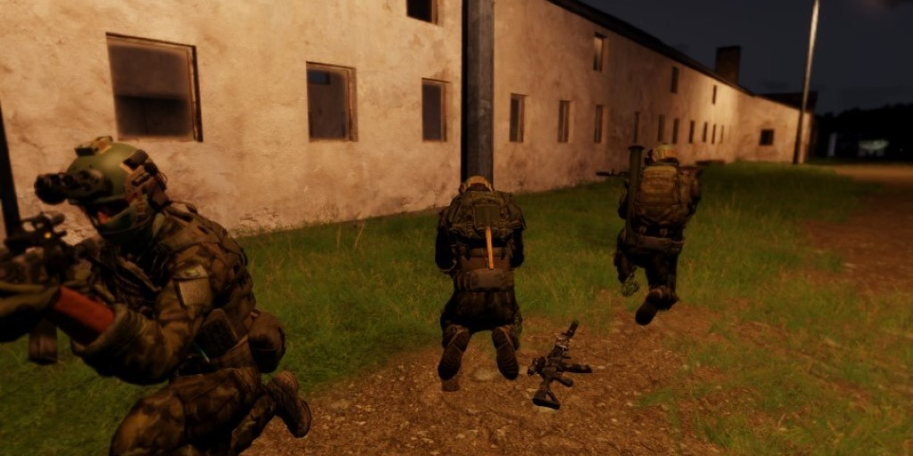

# CPC-CO[17]-Symphony_of_Destruction.Enoch

> "We dance like Marionettes, Swaying to the symphony"
> --Megadeth, 1992

## Contexte

23 Juin 2015 - 23:30 | Ukraine

La guerre du Donbass fait rage depuis le début de l'année dernière. Un accord avait été trouvé en Septembre mais quelqu'un a tiré trop vite et depuis Janvier, les combats recommence à s'intensifier.

En Février, M. Hollande et Mme Merkel se sont déplacés en Russie et en Ukraine pour négocier un nouveau plan de paix. Pas de bol pour les bouffeurs de baguettes, leur président est jamais revenu et les Kommando ont pas tout à fait apprécié de devoir récupérer leur Chancelière en Huey suite à la prise d'otage de Irpin (près de Kiev).

Comme la moitié des forces Européennes vont débarquer dans notre chasse gardée, pour soit disant amener la paix et la démocratie, nos supérieurs ont décidé qu'il était temps que l'Ukraine s'assimile à notre glorieuse patrie, et on a mobilisée toute l'armée pour l'occasion.
Visiblement, les Bleus étaient surpris de voir la puissance de feu Russe. Ils n'ont pas tenu le choc et sont repartis dans les jupons de leur mères.

Et face à tout le monde, une partie de la population locale s'oppose aux Russes et aux Européens et cherchent à 'libérer le pays eux même'. Mais eux c'est des paysans, ils vont vite comprendre qu'ils n'ont rien à faire ici.

## Mission

Le front n'a pas bougé depuis plusieurs jours, et les Haut Gradés n'aiment pas ça. Ils veulent donc que l'on prennent la ville de _Topolin_.

Mais ça, c'est pas votre boulot. Votre boulot c'est d'empêcher que l'ennemi nous envoie du renfort au moment où on a pas besoin.

Il va falloir déstabiliser leurs communications, miner les routes, et faire le ménage avant que le gros des troupes ne partent à l'assaut.

Insertion :
Vous êtes insérés _en lisière de la forêt situé au Sud-Est de l'objectif_.

Objectifs :

- _Éliminez les potentiels renforts_.
- Détruire l'antenne radio d'_Adamow_ et celle de _la carrière_).
- Miner les routes _du Nord-Est_, _du Nord_ et _du Nord-Ouest_. Les marqueurs sont là à titre indicatif, placer les mines où vous voulez, tant qu'elles feront sauter les renforts.

Détection :
Les ennemis ont des oreilles. Si vous parlez trop fort et trop près d'eux, ils vont repéreront. Alors tâchez d'être concentrés.

Lorsque vous avez fini, appelez nous avec la commande radio 0-0-5. On organisera votre extraction (l'appel ne marque pas la fin de la mission)

## Crédits

Mission faite par OxyTom.

Merci à Shinriel, Morbakos (et sûrement d'autres) pour les tutos.
Merci à Sparfell, Mystery, Shinriel et Tanin pour GDC_lib.
Merci à Hunter et Seegan pour l'aide sur les loadouts (et le nom).
Merci à tout les canards pour m'avoir inspiré.
